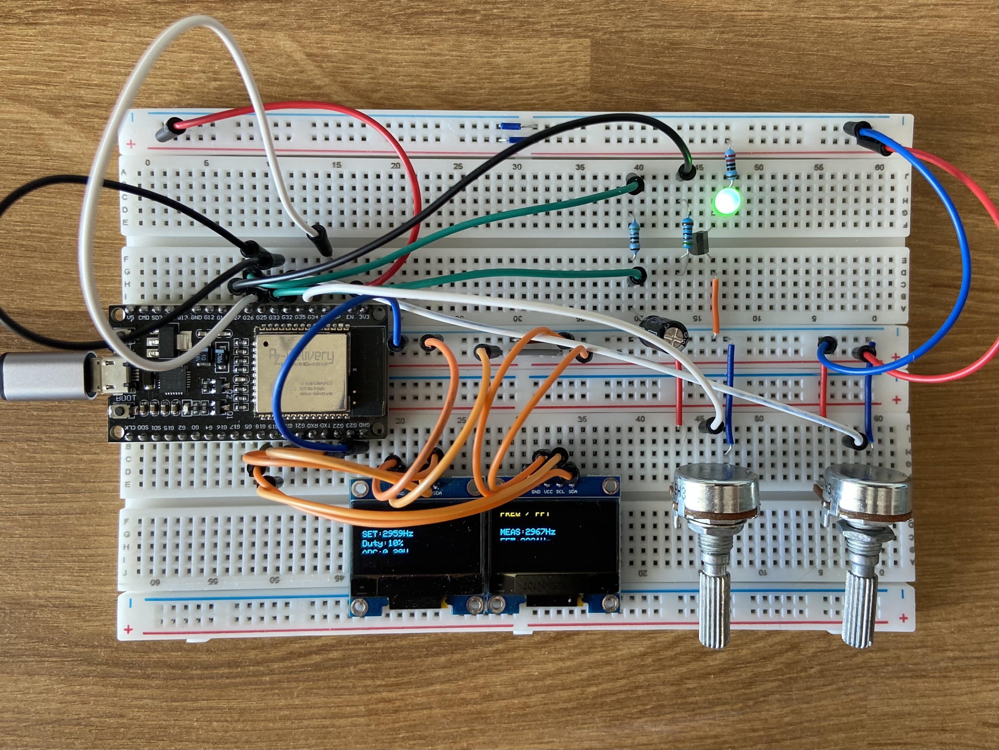
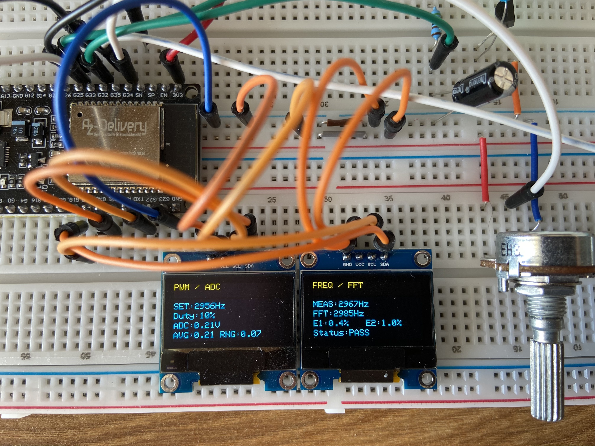

# Embedded Signal Analyzer & Test Bench

## Présentation

Mini banc de test électronique basé sur ESP32.

Ce projet permet de générer, mesurer et analyser différents signaux électroniques afin d'étudier les notions de PWM, filtrage RC, acquisition analogique, mesure de fréquence et analyse FFT.

Réalisé dans le cadre de ma reconversion vers l'électronique afin de développer des compétences en systèmes embarqués, traitement du signal et validation électronique.

## Prototype



## Résultats sur double OLED



---

## Objectifs

- Générer un signal PWM réglable
- Contrôler la fréquence et le duty cycle en temps réel
- Réaliser un filtrage RC passe-bas
- Mesurer une tension analogique avec l'ADC de l'ESP32
- Appliquer un traitement numérique (moyenne glissante)
- Mesurer la fréquence d'un signal
- Réaliser une analyse FFT
- Mettre en œuvre un diagnostic automatique

---

## Fonctionnalités

### Génération

- PWM configurable
- Réglage de fréquence par potentiomètre
- Réglage du duty cycle par potentiomètre

### Acquisition

- Mesure ADC du signal filtré
- Calcul de moyenne glissante (AVG)
- Analyse de stabilité du signal (RNG)

### Analyse

- Mesure fréquentielle temporelle (MEAS)
- Analyse fréquentielle FFT
- Calcul d'erreur de mesure
- Validation PASS / WARN / FAIL

---

## Architecture système

### Génération du signal

```text
ESP32
  └── PWM (GPIO25)
```

### Conditionnement analogique

```text
PWM
 └── Résistance 4.7 kΩ
      └── Point de mesure ADC
           └── Condensateur
                └── GND
```

### Traitement numérique

- Acquisition ADC
- Moyenne glissante
- Calcul du Range (RNG)
- Diagnostic automatique

### Analyse fréquentielle

- Mesure de fréquence temporelle
- FFT sur 512 échantillons
- Comparaison entre fréquence générée et fréquence détectée

### Interface utilisateur

#### OLED 1

Affichage :

- Fréquence de consigne (SET)
- Duty cycle
- Tension ADC
- Moyenne glissante (AVG)
- Stabilité du signal (RNG)

#### OLED 2

Affichage :

- Fréquence mesurée (MEAS)
- Fréquence FFT
- Erreur de mesure
- État du diagnostic

---

## Documentation

La documentation détaillée est disponible dans le dossier :

```text
docs/
```

### Contenu

- Architecture
- Wiring
- Signal Processing
- Tests Results
- Development Journal
- Lessons Learned

---

## Évolutions prévues

### V2 - Waveform Generator

Développement d'un générateur de signaux dédié sur une seconde breadboard :

- Génération d'ondes carrées
- Génération d'ondes triangulaires
- Génération d'ondes sinusoïdales
- Contrôle de fréquence et d'amplitude
- Validation des signaux via le banc de test

### V3 - Spectrum Analyzer

Extension des capacités d'analyse fréquentielle :

- Optimisation de la FFT
- Visualisation spectrale en temps réel
- Analyse harmonique des signaux générés
- Étude des effets du filtrage analogique

### V4 - Automatic Test Bench

Transformation du projet en véritable banc de test électronique :

- Procédures d'auto-test automatisées
- Validation PASS / FAIL avancée
- Tests de composants électroniques
- Génération de rapports de mesure

### Long terme

- DAC externe pour génération analogique haute qualité
- Interface utilisateur avancée
- Sauvegarde des mesures
- Communication PC et export de données

---

## Auteur

Paul Malye

Projet réalisé dans le cadre d'une reconversion professionnelle vers l'électronique et les systèmes embarqués (BTS CIEL).
